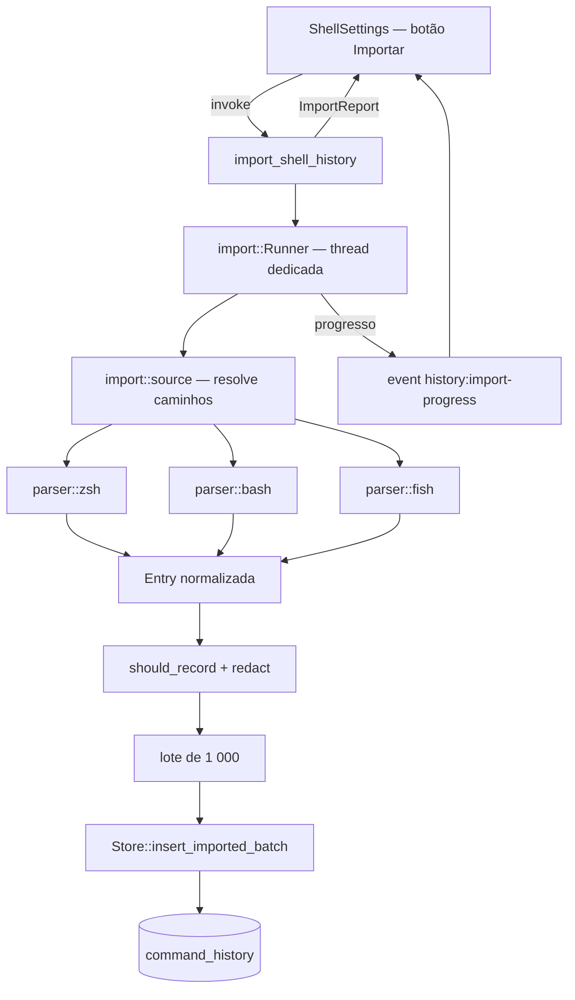

# Import de histórico de shell — Design

**Spec**: `.specs/features/shell-history-import/spec.md`
**Status**: Draft

Narrativa em pt-BR; identificadores em inglês, como o resto do código.

---

## Architecture Overview

O import é um pipeline de uma direção só, todo no core, disparado por comando Tauri e rodando em thread própria. Nada dele toca a thread emissora do PTY.



O ranking é o outro lado da entrega e não passa pelo pipeline: são duas correções cirúrgicas em `history::frecency` e na consulta de candidatos, sem as quais o pipeline acima enche o banco sem mudar nada para o usuário.

---

## Code Reuse Analysis

### Existing Components to Leverage

| Component | Location | How to Use |
| --------- | -------- | ---------- |
| `redact` | `src-tauri/src/session/redact.rs:21` | Chamado por entrada importada, sem caminho alternativo (HIMP-03) |
| `history::should_record` | `src-tauri/src/history/mod.rs:77` | O mesmo filtro de `ignorespace` da captura ao vivo |
| `history::frecency` + `HistoryCandidate` | `src-tauri/src/history/mod.rs:164` | Ganha um campo; a função continua pura e testada |
| `Store` (`Mutex<Connection>`) | `src-tauri/src/session/store.rs` | Novo método de lote; migration no mesmo padrão `let _ = conn.execute("ALTER TABLE …")` |
| Padrão de progresso por evento | `src-tauri/src/lsp/managed/mod.rs:232` | Mesma forma de emitir progresso de tarefa longa |
| `sha2 0.10` | `src-tauri/Cargo.toml:35` | Já é dependência; gera a `import_key` |
| Seção de histórico em Configurações | `src/components/ShellSettings.tsx:122` | O botão e o relatório entram ao lado do toggle e do "limpar" |
| Wrappers de IPC | `src/lib/ipc.ts:1330` | Mesma forma dos comandos de histórico existentes |

### Integration Points

| System | Integration Method |
| ------ | ------------------ |
| `command_history` | Uma coluna nova (`import_key`) e um índice UNIQUE; nenhuma tabela nova |
| Paleta de comandos | Consome o mesmo `search_command_history`; muda a consulta por baixo, não o contrato |
| Sessão de agente | Nenhuma. O agente só alcança `HookAction` pelo `hook_ipc`; comando Tauri não é superfície dele (HIMP-10) |

---

## Components

### `history::import::source`

- **Purpose**: descobrir quais fontes existem e onde, sem ler conteúdo para o banco.
- **Location**: `src-tauri/src/history/import/source.rs`
- **Interfaces**:
  - `fn resolve(env: &Env, home: &Path) -> Vec<ResolvedSource>` — caminho por fonte, `$HISTFILE` quando presente no ambiente do core, senão o padrão
  - `fn scan(sources: &[ResolvedSource]) -> Vec<SourceScan>` — conta entradas sem gravar; alimenta o convite (P2) e o botão
- **Dependencies**: nenhuma além de `std::fs`
- **Reuses**: —

### `history::import::parser`

- **Purpose**: transformar bytes de um formato em `ImportedEntry`; é a parte frágil e por isso é pura.
- **Location**: `src-tauri/src/history/import/parser/{zsh,bash,fish}.rs`
- **Interfaces**:
  - `fn parse_zsh(reader: impl BufRead, mtime_ms: i64) -> impl Iterator<Item = Result<ImportedEntry, ParseSkip>>`
  - `fn parse_bash(...)`, `fn parse_fish(...)` — mesma forma
- **Dependencies**: —
- **Reuses**: —
- **Nota**: iterador sobre `BufRead`, nunca `read_to_string` — arquivo de anos não entra em memória de uma vez.

### `history::import::Runner`

- **Purpose**: orquestrar leitura → parse → filtro → redação → lote, em thread própria, com um import por vez.
- **Location**: `src-tauri/src/history/import/mod.rs`
- **Interfaces**:
  - `fn start(store: Arc<Store>, sources: Vec<ResolvedSource>, on_progress: impl Fn(Progress)) -> Result<ImportReport, ImportError>`
  - `fn is_running() -> bool` — `AtomicBool` estático; segundo disparo é recusado, não enfileirado (HIMP-07)
- **Dependencies**: `Store`, os parsers
- **Reuses**: `redact`, `should_record`

### `Store::insert_imported_batch`

- **Purpose**: gravar um lote dentro de uma transação, deixando o banco recusar a duplicata.
- **Location**: `src-tauri/src/session/store.rs`
- **Interfaces**:
  - `fn insert_imported_batch(&self, entries: &[ImportedEntry]) -> Result<BatchOutcome, StoreError>` — `INSERT OR IGNORE`, statement preparado, uma transação por lote
  - `fn evict_command_history(&self) -> Result<usize, StoreError>` — roda **uma vez** ao fim do import, não por linha
- **Dependencies**: —
- **Reuses**: o padrão de migration idempotente já usado no `open`
- **Nota**: **não** reusa `insert_command`. Aquele caminho faz um `SELECT` do anterior e um `DELETE` de eviction por inserção — correto para uma linha por vez, catastrófico para 100 000.

### `Store::history_candidates_matching`

- **Purpose**: dar ao ranking os candidatos que casam com a query, em vez da janela dos mais recentes.
- **Location**: `src-tauri/src/session/store.rs`
- **Interfaces**:
  - `fn history_candidates_matching(&self, needle: &str, cwd: Option<&str>, repo_root: Option<&str>) -> Result<Vec<HistoryCandidate>, StoreError>`
- **Dependencies**: —
- **Reuses**: a mesma agregação de `history_candidates`, com `WHERE command LIKE ?` e o mesmo teto de linhas
- **Nota**: query vazia continua indo por `history_candidates` — "últimos comandos" é uma lista por recência e deve continuar sendo.

### Comandos Tauri

- **Purpose**: a superfície humana.
- **Location**: `src-tauri/src/lib.rs`
- **Interfaces**:
  - `scan_shell_history_sources() -> Vec<SourceScan>` — conta, não grava
  - `import_shell_history(sources: Vec<ImportSource>) -> ImportReport`
- **Dependencies**: `AppState.store`
- **Reuses**: `AppError { code, params }` para erro bilíngue

### UI de import

- **Purpose**: botão, progresso e relatório por fonte.
- **Location**: `src/components/ShellSettings.tsx`, `src/lib/ipc.ts`, `src/i18n`
- **Interfaces**: `scanShellHistorySources()`, `importShellHistory(sources)`; assinatura do evento `history:import-progress`
- **Reuses**: a seção de histórico existente, o padrão de toast e as chaves de i18n pt/en

---

## Data Models

```rust
pub enum ImportSource { Zsh, Bash, Fish }

pub struct ResolvedSource { pub source: ImportSource, pub path: PathBuf, pub mtime_ms: i64 }

pub struct SourceScan { pub source: ImportSource, pub path: PathBuf, pub entries: usize }

pub struct ImportedEntry {
    pub command: String,
    pub started_at_ms: i64,
    pub duration_ms: Option<i64>,
    pub exit_code: Option<i32>,   // sempre None nas três fontes de texto
    pub import_key: String,
}

pub struct SourceOutcome {
    pub source: ImportSource,
    pub read: usize,
    pub imported: usize,
    pub discarded: usize,
    pub skipped: Option<String>,   // motivo, quando a fonte inteira foi pulada
}

pub struct ImportReport { pub sources: Vec<SourceOutcome> }
```

`HistoryCandidate` ganha `known_exit_codes: u32` — quantas entradas daquele comando têm código conhecido. É o campo que separa "só falhou" de "não se sabe".

### Migration

```sql
ALTER TABLE command_history ADD COLUMN import_key TEXT;
CREATE UNIQUE INDEX IF NOT EXISTS command_history_import_key
  ON command_history (import_key);
```

No SQLite, NULL não colide com NULL em índice UNIQUE: linha viva mantém `import_key` nulo e nada muda para ela.

`import_key = "<fonte>:<sha256(comando_redigido || 0x1F || started_at_ms)>"`.

**O ordinal da entrada dentro do arquivo fica de fora da chave, de propósito.** Incluí-lo faria o reimport duplicar tudo depois que o zsh apara o arquivo por `SAVEHIST` (as posições andam). Deixá-lo de fora custa perder uma segunda ocorrência idêntica no mesmo segundo — uma unidade de contagem em um comando que já vai aparecer. Perder uma contagem é barato; duplicar o corpus corrompe o ranking inteiro.

---

## Error Handling Strategy

| Error Scenario | Handling | User Impact |
| -------------- | -------- | ----------- |
| Arquivo de fonte ausente | Fonte omitida do relatório | Não aparece na lista de fontes |
| Arquivo ilegível (permissão) | `SourceOutcome.skipped` com o motivo; demais fontes seguem | Vê a fonte marcada como pulada e por quê |
| Linha com UTF-8 inválido | Entrada descartada, contador `discarded` incrementado | Vê a contagem de descartadas |
| Formato não reconhecido na linha | Idem, descartada | Idem |
| Erro de SQLite no meio | Aborta o import; lotes já commitados permanecem | Vê erro e as fontes concluídas até ali |
| Import já em andamento | Recusa com código de erro dedicado | Toast avisando que já tem um rodando |
| App fechado no meio | Nada especial: cada lote é uma transação | Reimportar retoma; a chave UNIQUE evita duplicata |

---

## Risks & Concerns

| Concern | Location | Impact | Mitigation |
| ------- | -------- | ------ | ---------- |
| **Eviction é FIFO por `id`** — importar 100 000 linhas com `id` novo empurra para fora justamente as linhas **vivas**, que têm `id` menor | `store.rs:789` | O import apagaria o histórico real do usuário para caber o importado. É o oposto do objetivo | Eviction passa a ser por `started_at_ms` (a mais antiga sai), não por `id`. Vira AD-004 — é regra de projeto, não detalhe desta feature |
| `insert_command` faz `SELECT` do anterior + `DELETE` de eviction **a cada** inserção | `store.rs:760` | Reusá-lo no import daria ~200 000 statements extras e travaria o lock do store | Caminho de lote separado, statement preparado, eviction uma vez ao fim |
| `$HISTFILE` normalmente **não** chega ao processo do TYBA (é definido no rc do shell, sem export) | `history::import::source` | Quem move o histórico para caminho não-padrão não é encontrado | Padrão primeiro, env quando presente; a fonte não encontrada aparece no relatório. Escolher arquivo à mão fica como pendência, fora do P1 |
| Formato do `fish_history` (escape de newline dentro de `cmd:`) não verificado contra a doc do fish | `parser/fish.rs` | Parser errado corrompe comando multilinha em silêncio | Verificar na doc do fish **antes** de escrever o parser; fixture sintética derivada da doc, nunca de arquivo real |
| `LIKE '%q%'` sobre até 100 000 linhas a cada 120 ms de digitação | `history_candidates_matching` | Latência na paleta, competindo com os agentes por CPU | Teto de linhas na consulta e medição na task; FTS5 fica como escape documentado, não como plano |
| Fixture de histórico é dado pessoal | testes | Copiar `~/.zsh_history` real para o repo público publica o que o dono digitou | Fixtures sintéticas escritas à mão — regra do `CLAUDE.md`, e o teste de parser é o lugar onde a tentação aparece |
| Nenhum teste cobre hoje a eviction de `command_history` | `store.rs` | Mudar de `id` para tempo sem teste é mudar às cegas | Task própria: teste de eviction por idade antes da mudança |

---

## Tech Decisions

| Decision | Choice | Rationale |
| -------- | ------ | --------- |
| Idempotência | Chave de conteúdo com índice UNIQUE, relendo o arquivo inteiro | zsh e fish **reescrevem** o arquivo ao aparar; offset guardado passa a apontar para o meio de outra entrada e duplica em silêncio |
| Ordinal na chave | Fora | Ver Data Models: perder contagem é barato, duplicar corpus não |
| Busca | Pré-filtro em SQL quando há query; janela recente só para query vazia | Mantém o trabalho por tecla limitado e torna o importado alcançável |
| Eviction | Por `started_at_ms`, não por `id` | Sem isso o import expulsa o histórico vivo — vira AD-004 |
| Lote | 1 000 entradas por transação | O lock do store nunca fica preso pelo arquivo inteiro, e o que commitou sobrevive a fechamento no meio |
| Thread | Dedicada, um import por vez | Mesma disciplina da thread escritora: SQLite fica longe do caminho quente |

> **Project-level:** a eviction por idade vira `AD-004` em `.specs/STATE.md`.
