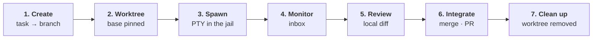

An agent session in TYBA is not a chat window. It's a pipeline, and every stage is enforced by the Rust core — the interface only draws what the core decided.

Understanding these seven stages is understanding the whole product.



## 1. Create

You describe the task. The core resolves the repository root and derives a branch:

```
tyba/<slug>-<suffix>
```

The short random suffix is what keeps two sessions on the same task from fighting over one branch name.

## 2. Worktree

`git worktree add` off the current base — and **the base SHA is pinned right here**.

That's what makes the review in step 5 usable: every diff you see later is `base_sha..HEAD`. An agent that spent two hours working doesn't drown you in everything else that landed on `main` meanwhile.

If the repository has a `.tyba/setup.sh`, it runs now — that's the place to symlink `.env`, run `bun install`, spin up a per-worktree database.

## 3. Spawn

The PTY starts **inside** the sandbox, with an env built from an allowlist.

Your `DATABASE_URL` and your tokens are simply not there — the agent gets six variables plus whatever the [repository's `.tyba/config.toml`](/en/reference/repo-config) authorizes, after you approve it.

Writes are limited to the worktree and temp. Reads depend on the platform — and that difference is in [Platforms](/en/security/platforms).

## 4. Monitor

The session reports status:

| Status | What it is |
| --- | --- |
| `Running` | working |
| `AwaitingInput` | **needs you** |
| `Idle` | done, waiting |
| `Exited` | over |

When something needs your approval, it becomes an inbox item with a native notification — and the session **stays blocked** until you answer. You answer right there, without switching windows, and the answer is written straight into that PTY.

What needs approval and what goes through on its own is in [Risk classification](/en/security/risk-classification).

<Note>
Status is not guessed by scraping the screen. TYBA injects hooks into the agent and listens for the events on a local channel: the tool about to run becomes `Running`, the end of a turn becomes `Idle`, and a request for an answer becomes `AwaitingInput`. It's the same channel that feeds the approvals inbox — [how TYBA talks to the agent](/en/agent/hooks).
</Note>

## 5. Review

The review is built **from local git only** — there is no round-trip to GitHub. Commit timeline, per-file summary, and hunks loaded on demand when you click.

<Note>
A lockfile diff is tens of thousands of lines. It stays collapsed until you ask for it.
</Note>

Work the agent left uncommitted shows up too.

## 6. Integrate

Local merge, squash, or `gh pr create` through your own `gh`.

<Note>
Push and merge are executed **by TYBA, outside the jail**. The agent's session never had network credentials — and that is exactly the point. The button that approves a push lives inside the review, after you've seen the diff.
</Note>

And, whatever happens: [an agent pushing to `main` or `master` is refused by the core](/en/security/risk-classification#what-never-even-gets-asked). Always.

## 7. Clean up

`git worktree remove` and garbage collection of orphan branches.

## What to do now

Run two sessions at once in the same repository. That's where the design shows: session A editing `src/` can't see or clobber session B's tree, and neither of them touches your working copy.

<CardGroup cols={2}>
  <Card title="Risk classification" icon="shield" href="/en/security/risk-classification">
    What the agent does on its own and what waits for you.
  </Card>
  <Card title="Configuration" icon="sliders" href="/en/reference/repo-config">
    Environment and default agent, per repository.
  </Card>
</CardGroup>
