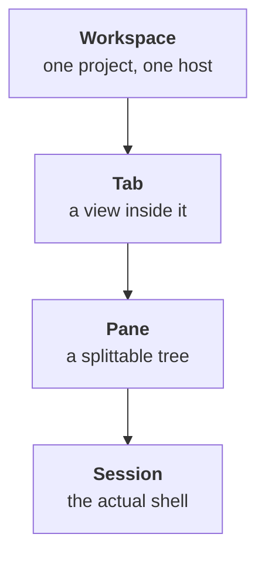

TYBA has four stacked layers. Understanding their order clears up 90% of the confusion for anyone who just opened the app.

| Layer | What it is |
| --- | --- |
| **Workspace** | The container for everything. It has a name, a color, a group and a folder. It's what the sidebar lists. |
| **Tab** | A view inside the workspace. A workspace has several. |
| **Pane** | The tree of splits inside the tab. Every pane can be split again. |
| **Session** | The shell, the agent or the SSH connection running there. It's the process. |

<Warning>
**The interface calls a workspace a "session".** The sidebar, the context menu (*Rename session*, *Session options*) and the palette (*Search sessions…*) use the word "session" to talk about the **workspace** — not the shell.

In this documentation, *workspace* is the layer and *session* is the process. When you see "session" on screen, most of the time it's the workspace.
</Warning>

## The sidebar

`⌘B` on macOS, `Ctrl+Shift+B` on Windows and Linux. Also the icon to the left of the header.

It lists **workspaces**, not tabs. Top to bottom:

| | |
| --- | --- |
| **Search** | *Search sessions…* — filters the list. Only shows with the sidebar open. |
| **System** | One item: *Settings*. It's the gear. |
| **Code** | *Worktrees* — disabled, marked **Soon**. |
| **Your groups** | Each group folds at the caret and has a `+` (*New session in this group*). |
| **Ungrouped** | Workspaces without a group. |
| **Footer** | *New session* and *SSH Connections*. |

<Note>
The gear is **at the top**, in the *System* group — not in the footer.
</Note>

### What the toggle does

`⌘B` switches between **open** and a second state you choose in **Settings → Collapse panel**:

| Option | What it does |
| --- | --- |
| **Collapse fully** (default) | The sidebar disappears. |
| **Icon rail** | It becomes a narrow strip with icons only. |

It's not a three-way cycle — it's an on/off between open and the option you picked.

### Hover preview

Hovering **a workspace in the sidebar** opens a card with status (*Running* / *Idle*, or the agent's state), the runner, the folder, the branch, the diff and the tab count.

<Note>
That preview is **the sidebar's**. Hovering a **tab** shows nothing — a tab only has the tooltip for its numeric shortcut.
</Note>

### Two toggles that change the density

In **Settings → Preferences**:

| Preference | What it does |
| --- | --- |
| **Session details in the sidebar** | Shows more information on each row. You can override it per workspace in the context menu (*Show details* / *Hide details*). |
| **Git status in the sidebar** | Adds a badge with the number of uncommitted changes when the folder has changes. |

## The header

A thin strip at the top. Left to right:

| Item | What it does |
| --- | --- |
| **Toggle panel** | Turns the sidebar on and off. |
| **Command palette** | Opens the [actions palette](/en/interface/command-palette). |
| **Terminal / Workspace** | In the center. **Workspace is disabled — *Soon*.** |
| **Clock** | The time. |
| **Containers** | Only with Docker. Green dot = a container is running; red = the daemon is down. |
| **View changes** | Opens the diff. Turns amber when there's uncommitted work. |
| **Open project folder** | `⌘O` / `Ctrl+Shift+O`. |
| **Notifications** | The inbox. |
| **Account** | Menu with *Settings* and *About Tyba*. |

## The inbox

The tray icon in the header, with a violet counter when something is pending. It's where **agent approvals** go through.

Each item shows the risk, the command, the session and the folder — and clicking the session row takes you there. With the inbox open, `1` `2` `3` decide **the first one in the queue**.

<Warning>
**A red action takes two clicks.** Approving a high-risk command turns the button into *Confirm* — only the second click resolves it. And red [never has "Always"](/en/security/risk-classification#what-always-really-means).
</Warning>

When empty, it says: *All caught up. Agent session notifications arrive here.* When the last approval is gone, it closes by itself.

<Note>
**The inbox has no shortcut.** Only clicking the icon opens it.
</Note>

## The chip bar

A 24px strip at the **terminal's footer**, on by default. It's what the **Chip bar** preference controls.

Six chips exist — and "diff" is really two:

| Chip | What it shows |
| --- | --- |
| **Current folder** | The folder name. The full path in the tooltip. |
| **Git branch** | The branch. |
| **Uncommitted changes** | `files • +insertions −deletions`. Disappears when clean. Clicking opens the diff. |
| **Review worktree diff** | Only when the session has a worktree. |
| **Commits ahead and behind upstream** | Disappears when both are zero. |
| **Clock** | Updates every 30s. |

Default: *Uncommitted changes* and *Review worktree diff* on the left; *ahead/behind*, *branch*, *folder* and *clock* on the right.

### Rearranging

With the bar on, the **Bar chips** editor appears: drag between **Left**, **Right** and **Hidden**. *Restore defaults* brings back the original arrangement — but it does **not** turn the bar on or off.

It works from the keyboard: space picks the chip up, the arrows move it, space drops it, `Esc` cancels.

<Note>
The bar also hosts the **Rich Input** button (`⌘⇧G` / `Ctrl+Shift+G`) when the session is eligible. It isn't a chip and doesn't show up in the editor.
</Note>

## Where to go next

<CardGroup cols={2}>
  <Card title="Tabs and workspaces" icon="layout" href="/en/interface/tabs-and-workspaces">
    The difference between the two, and what each one lets you do.
  </Card>
  <Card title="Split panes" icon="columns" href="/en/interface/split-panes">
    Split, navigate, resize.
  </Card>
  <Card title="Command palette" icon="command" href="/en/interface/command-palette">
    The two palettes and the difference between them.
  </Card>
  <Card title="Shortcuts" icon="keyboard" href="/en/interface/shortcuts">
    The whole list, and how to remap.
  </Card>
</CardGroup>
