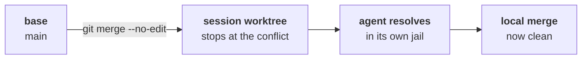

Local merge is the way out for anyone who isn't going to open a PR: it takes the session's commits and puts them on the **base branch**, right there, with no network.

It lives in **Deliver → Merge locally**, at the footer of the review panel. It comes painted red and marked `red action` — because it touches your main repository.

## The preview

Opening the dialog fires `worktree_merge_preview` before anything else. It shows:

```
tyba/corrige-login-a3f → main

3 commits · 12 files
```

And underneath, what the preview actually went to fetch:

| Field | Where it comes from |
| --- | --- |
| `commits` | how many commits the session has beyond the base |
| `files_changed` | `git diff --name-only base...HEAD` |
| `conflicts` | `git merge-tree --write-tree` — the merge is **simulated**, touching nothing |
| `base_dirty` | whether the **main repo** has uncommitted work |

`merge-tree` is the point: TYBA knows whether there will be a conflict **without** doing the merge, without a checkout, without a stash, without touching your working directory.

## The three locks

The *Merge into base* button stays off, with the reason spelled out, in three cases:

<Warning>
**The base is dirty.** *The base branch has uncommitted changes — commit or discard them before merging.* TYBA is not going to move your work in progress out of the way to fit a merge.
</Warning>

<Warning>
**There is a conflict.** *Conflicts with the base in: `file`, `file`.* This is where the escape button shows up — see below.
</Warning>

<Note>
**There is nothing to merge.** *Nothing to merge: no commits beyond the base.* Or the session is on the base branch itself, and then there is nothing to do.
</Note>

## Strategy

| | |
| --- | --- |
| **Squash** (default) | A single commit on the base. Automatic message: `squash: <branch>` |
| **Merge commit** | Keeps the session's history. Automatic message: `merge: <branch> em <base>` |

<Note>
The core accepts a custom message, **but the dialog has no field for it**. Today the message is always the automatic one.
</Note>

## Confirm

Two clicks. The first arms it (*Confirm merge?*, the button turns red), the second executes.

And what executes **is not `git merge`**:

```bash
git commit-tree <tree> -p <base_head> [-p <source_head>] -m <msg>
git merge --ff-only <new-commit>
```

The tree already came from `merge-tree`. The commit is created directly and the base moves forward by fast-forward. If the base changed between the preview and the click, `--ff-only` fails and you see *The base branch moved during the merge — nothing changed, try again*.

<Note>
**The base is never left half-merged.** Either the fast-forward goes through, or nothing happened. There is no intermediate state for you to clean up.
</Note>

## Materialize: when there is a conflict

With the merge locked by a conflict, the dialog offers **Resolve with agent**. It does the thing backwards — and on purpose:



`materialize` brings the **base into the session's worktree** and lets the merge stop at the conflict. The conflicted files stay there, with markers, and TYBA sends the resolution prompt to that session's agent.

Your checkout is not touched at any point. Once the conflict is resolved in the session, the local merge runs clean.

<Warning>
Materialize requires the **session's worktree to be clean**: *The session worktree has uncommitted changes — commit or discard them before materializing the conflict.*
</Warning>

## After the merge

The dialog gives way to **Delivered — what about the worktree?**:

- **Keep** — the worktree stays, the session stays.
- **Remove worktree and close session** — two clicks, and it's gone.

<Warning>
Removing is `worktree remove --force` **plus `git branch -D`**: the worktree goes away and so does the local branch. If uncommitted work was left behind, the warning appears before the second click — *did NOT go into the PR/merge — removing will discard it permanently*.
</Warning>

## What does not exist

| | |
| --- | --- |
| **Rebase onto the base** | Does not exist. Squash or merge commit. |
| **Editable merge message** | The core accepts it; the interface doesn't offer it. |
| **Merging into a branch other than the base** | Does not exist. The base is the branch **the main repo is on right now**. |
| **Merging a session without a worktree** | Does not exist — the command requires a worktree. |

## See also

<CardGroup cols={2}>
  <Card title="Pull requests" icon="git-pull-request" href="/en/review/pull-requests">
    The other way out — the one that goes through the forge.
  </Card>
  <Card title="Worktrees" icon="folder-tree" href="/en/git/worktrees">
    Where the base was pinned, and what's left after removing.
  </Card>
</CardGroup>
