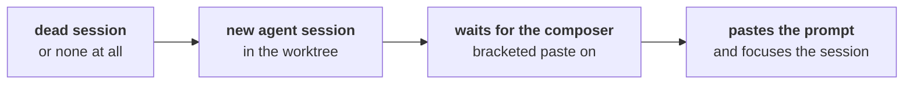

The cycle TYBA closes here is the most tedious one to do by hand: someone reviewed the PR, left comments scattered across files and lines, and now **someone has to transcribe that for the agent**.

You don't have to. The panel reads the comments, you tick the ones that matter, and they go to the composer of the session that wrote the code.

## Where it lives

Inside the review panel, under **Deliver**, right below the PR line — **Review comments**. It only appears when there is a PR open for the session's branch.

<Note>
Needs `gh` (or `glab`) installed and authenticated. Without the CLI, the list comes up **empty**, with no error: reading comments is the forge's API, and without the CLI there is no path to it. This is not your fault — most people don't install `gh`.
</Note>

## What it reads

<Tabs>
  <Tab title="GitHub">
    Two collections, merged into the same list:

    ```
    repos/{owner}/{repo}/pulls/<n>/comments    → line comments
    repos/{owner}/{repo}/issues/<n>/comments   → general PR comments
    ```
  </Tab>
  <Tab title="GitLab">
    ```
    projects/:fullpath/merge_requests/<n>/discussions
    ```
    The MR's discussions.
  </Tab>
</Tabs>

Each item shows `@author`, the file and the line (when the comment is anchored), and the text.

## Tick and check

Tick the checkbox on what should become work. *Select all* / *Clear selection* in the corner.

With something ticked, **This is what gets sent to the agent** appears — the exact prompt, expanded by default. It is not a summary: it is the text that will be pasted.

```
Review do PR #42 (https://github.com/org/repo/pull/42) trouxe 2 comentário(s):

src/auth.ts:88 — @maria
Isso aqui não trata o caso do token expirado.

comentário geral — @joao
Falta teste pro caminho de erro.

Aplique as mudanças pedidas, mantendo o resto como está.
```

<Warning>
**Third-party content — review before forwarding to the agent.**

The warning is in the interface, and it is literal. A PR comment is text written by anyone with access to the repository, and you are about to paste it into an agent that edits code. The preview exists so you read it first, not so you can memorize it.

What protects you on the other side is the [risk classification](/en/security/risk-classification): the prompt does not change what the agent can do on its own.
</Warning>

## Forward

**Forward N comments to the agent**. TYBA pastes the prompt into the session's composer and **moves focus to it**.

<Note>
The prompt is **pasted, not sent**. `submit` goes `false`: you read it, adjust it, and hit enter. TYBA does not speak for the agent.
</Note>

On success, the selection clears and *Forwarded to the agent ✓* appears.

## When there is no live session

This is the common case: the PR sat open for three days, you closed TYBA, the agent died. The worktree is still there.

So TYBA **opens a new session** in the worktree and starts the agent:



What starts is the **Review agent** from Settings.

<Warning>
It is always an **agent session**, never a shell with the binary typed into it. Typing `claude` into a shell would start the agent **without a sandbox, with your entire environment and — what matters — without the hooks**: with no `PreToolUse` there is no gate, and an agent outside the inbox does whatever it wants.
</Warning>

## Review agent

**Settings → Preferences → Review agent.**

> Who receives the diff comments when no session is open in the worktree: Tyba opens a session, starts this agent and pastes the prompt into its composer.

| Option | What it starts |
| --- | --- |
| **Claude Code** | `claude` |
| **Codex** | `codex` |
| **Custom command…** | whatever you write — e.g. `claude --model opus` |

The custom command **runs inside the worktree before the prompt is pasted**. It has to be a genuinely interactive agent: TYBA waits for the TUI to turn on bracketed paste (`DECSET 2004`) to know the composer is ready — up to 30 attempts of half a second each, because an agent's cold start blows past any fixed `sleep`. A command that never turns on bracketed paste never receives the prompt.

<Note>
The same setting decides who suggests the commit message — with one caveat: [the suggestion only accepts `claude` or `codex`](/en/review/commit-and-push#which-agent-answers). A custom command falls back to `claude`.
</Note>

## The other two paths

The same plumbing serves two more things, and it's worth knowing they are the same machinery:

| Origin | Prompt |
| --- | --- |
| **Comments you left on the diff** ([Reading the diff](/en/review/reading-the-diff#comment-on-a-line)) | `Revisei o diff deste worktree (base <sha>..HEAD) e deixei N comentário(s)…` — with the line's snippet quoted |
| **Merge conflict** ([Local merge](/en/review/local-merge#materialize-when-there-is-a-conflict)) | the conflicted files, for the agent to resolve inside the jail |

In all three cases: prompt pasted, focus on the session, you hit enter.

## What does not exist

| | |
| --- | --- |
| **Replying to the comment on the forge** | Does not exist. TYBA reads; replying happens there. |
| **Marking resolved / resolving a thread** | Does not exist. |
| **Automatic refresh of the comments** | Does not exist. The list loads when the panel opens and when you switch PRs. |
| **Filtering by author or by file** | Does not exist. The list is the list. |
| **Sending without reading** | The preview is expanded by default, and that is on purpose. |

## See also

<CardGroup cols={2}>
  <Card title="Pull requests" icon="git-pull-request" href="/en/review/pull-requests">
    How the PR got here.
  </Card>
  <Card title="Claude Code and Codex" icon="bot" href="/en/agent/claude-code-and-codex">
    Who the agents TYBA knows how to start are.
  </Card>
</CardGroup>
