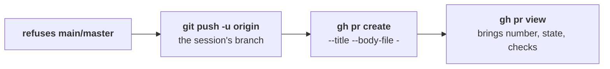

TYBA has no GitHub integration. It has **your `gh`** — and, on GitLab, your `glab`. No TYBA token, no OAuth, no account.

If you already run `gh pr create` in the terminal, the button does exactly that, from the right worktree, with the push first.

## How it figures out the forge

Only one thing is looked at: `git remote get-url origin`.

| Signal in the remote | Result |
| --- | --- |
| host contains `github` | **GitHub** → `gh` |
| host contains `gitlab` | **GitLab** → `glab` |
| unknown host, but the owner has a `/` (subgroup) | **GitLab** — subgroups are a GitLab thing |
| unknown host | checks the logged-in hosts in `~/.config/gh/hosts.yml` and in `glab`'s config |
| nothing matches | **no forge** |

This covers GitHub Enterprise and self-hosted GitLab without you configuring anything — as long as you have already logged into the CLI. Port and `user@` in the remote are ignored.

<Note>
A remote that is neither (Bitbucket, for example): the Deliver section says *No forge detected (origin isn't GitHub or GitLab) — only local merge is available*, and the PR button doesn't even appear.
</Note>

## What it requires

<CardGroup cols={2}>
  <Card title="To open a PR through TYBA" icon="terminal">
    `gh` (or `glab`) **installed and authenticated**.
  </Card>
  <Card title="To need nothing at all" icon="globe">
    The fallback: **Push and open in browser**.
  </Card>
</CardGroup>

Without the CLI, the dialog doesn't show the fields: it shows *`gh` isn't installed* and a button that pushes and opens your branch's comparison URL in the browser. You create the PR there.

Without authentication, the same — with the right message: *Run "gh auth login" in the session's terminal.*

<Note>
The CLI is only required to **see things inside TYBA**: PR state, checks, comments. Creating the PR works without it.
</Note>

### Where the CLI runs

Outside the jail, in an environment built by allowlist — `GH_TOKEN`, `GITHUB_TOKEN`, `GH_HOST`, `GH_CONFIG_DIR`, `GLAB_TOKEN`, `XDG_CONFIG_HOME`, proxy variables and little else. The rest of your environment does not come along. Network timeout: 30 seconds.

<Warning>
The agent's session **never** runs the forge CLI. Push and PR are executed by TYBA, after you click — which is why the button lives inside the review, after the diff.
</Warning>

## Opening the PR

In **Deliver**, the button says *Open PR* (GitHub) or *Open MR* (GitLab). The dialog asks for a title — already filled in with the session's title — and a description.

On confirm, in order:

You don't need to have pushed beforehand — `create_pr` does it.

<Warning>
Before any of that, the same lock as push: **branch `main` or `master` is refused**, and [there is never a way around it](/en/security/risk-classification#what-never-even-gets-asked).
</Warning>

| State | The button |
| --- | --- |
| No commits ahead (worktree) | Off — *Nothing to deliver — commit first.* |
| There is uncommitted work and no PR | Dimmed, but it works — what wasn't committed doesn't go. |
| A PR already exists for the branch | Becomes *View PR* and opens in the browser. |

## Following along

With a PR open for the session's branch, the Deliver section gains a line: state (`open`, `merged`, `closed`, `draft`), `#number`, an aggregate dot for the checks — green, red, or spinning amber — and a link to the forge.

### The forge panel

The GitHub (or GitLab) icon in the header opens a popover with two tabs.

<Tabs>
  <Tab title="CI">
    The **10 most recent runs** — it is not history, it is "so, what now?". A run in progress comes first; then, by date. Expanding a run lists the **jobs**; clicking opens it in the forge. Each run shows the branch **or tag** that triggered it, which is how you answer "I cut the tag, what about the release?".

    While a run is going, the panel refreshes every 15 seconds. Everything idle, it stops — each tick is a `gh` process competing with your agents.
  </Tab>
  <Tab title="Pull requests">
    The repository's PRs, newest to oldest. Expanding a PR lists **which check** is in what state — not just the aggregate dot.
  </Tab>
</Tabs>

<Note>
**GitLab CI: TYBA can't read it yet.** The panel says *I cannot read CI on this forge yet* — which is different from "no runs". PRs, MRs, PR checks and comments work on both forges; workflow runs and jobs, GitHub only.
</Note>

## After opening it

**Delivered — what about the worktree?** shows up: *PR opened. Remove this worktree and close the session, or keep it to keep working?*

<Warning>
**Removing deletes the local branch** (`git branch -D`) along with the worktree. The **remote** branch — the one the PR is using — stays. Uncommitted work does not: it's gone, and the dialog warns you before the second click.

If you are still expecting review comments, **Keep** is the answer.
</Warning>

## What does not exist

| | |
| --- | --- |
| **Picking the PR's base branch** | Does not exist. It's `gh`/`glab`'s default. |
| **Draft, reviewers, labels, assignees** | Does not exist. Title and description. |
| **Merging the PR through TYBA** | Does not exist. That's on the forge. |
| **Bitbucket and other forges** | Does not exist. GitHub and GitLab. |
| **A TYBA token** | Does not exist. The authentication is your CLI's. |

## See also

<CardGroup cols={2}>
  <Card title="PR comments to the agent" icon="message-square" href="/en/review/pr-comments-to-agent">
    The review came back. Send it straight to whoever wrote it.
  </Card>
  <Card title="Local merge" icon="git-merge" href="/en/review/local-merge">
    The way out without a forge.
  </Card>
</CardGroup>
