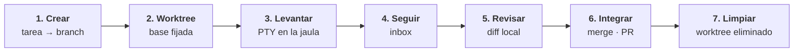

Una sesión de agente en TYBA no es una ventana de chat. Es un pipeline, y cada etapa la impone el core en Rust — la interfaz solo dibuja lo que él decidió.

Entender estas siete etapas es entender el producto entero.



## 1. Crear

Describes la tarea. El core resuelve la raíz del repositorio y deriva un branch:

```
tyba/<slug>-<sufijo>
```

El sufijo aleatorio corto es lo que impide que dos sesiones sobre la misma tarea peleen por el mismo nombre de branch.

## 2. Worktree

`git worktree add` a partir de la base actual — y **el SHA de la base se fija aquí**.

Eso es lo que hace utilizable la revisión del paso 5: todo diff que ves después es `base_sha..HEAD`. Un agente que pasó dos horas trabajando no te ahoga con todo lo que entró en `main` mientras tanto.

Si el repositorio tiene un `.tyba/setup.sh`, se ejecuta ahora — es el lugar para hacer symlink del `.env`, correr `bun install`, levantar una base de datos por worktree.

## 3. Levantar

El PTY nace **dentro** del sandbox, con un entorno construido por allowlist.

Tu `DATABASE_URL` y tus tokens simplemente no están ahí — el agente recibe seis variables y lo que el [`.tyba/config.toml` del repositorio](/es/referencia/config-de-repo) autorice, después de que lo apruebes.

La escritura queda en el worktree y en temp. La lectura depende de la plataforma — y esa diferencia está en [Plataformas](/es/seguridad/plataformas).

## 4. Seguir

La sesión reporta estado:

| Estado | Qué es |
| --- | --- |
| `Running` | trabajando |
| `AwaitingInput` | **te necesita** |
| `Idle` | terminó, esperando |
| `Exited` | se acabó |

Cuando algo necesita tu aprobación, se convierte en un ítem del inbox con notificación nativa — y la sesión **queda bloqueada** hasta que respondas. Respondes ahí mismo, sin cambiar de ventana, y la respuesta se escribe directo en ese PTY.

Qué necesita aprobación y qué pasa solo está en [Clasificación de riesgo](/es/seguridad/clasificacion-de-riesgo).

<Note>
El estado no se adivina raspando la pantalla. TYBA inyecta hooks en el agente y escucha los eventos en un canal local: la herramienta que va a ejecutarse se vuelve `Running`, el fin de turno se vuelve `Idle`, y una petición de respuesta se vuelve `AwaitingInput`. Es el mismo canal que alimenta el inbox de aprobaciones — [cómo TYBA habla con el agente](/es/agente/hooks).
</Note>

## 5. Revisar

La revisión se construye **solo desde el git local** — no hay ida al GitHub. Timeline de commits, resumen por archivo, y los hunks cargados bajo demanda al hacer clic.

<Note>
El diff de un lockfile tiene decenas de miles de líneas. Queda cerrado hasta que lo pidas.
</Note>

Lo que el agente dejó sin commitear también aparece.

## 6. Integrar

Merge local, squash, o `gh pr create` a través de tu propio `gh`.

<Note>
El push y el merge los ejecuta **TYBA, fuera de la jaula**. La sesión del agente nunca tuvo credenciales de red — y ese es exactamente el punto. El botón que aprueba un push vive dentro de la revisión, después de que hayas visto el diff.
</Note>

Y, pase lo que pase: [un push de agente a `main` o `master` lo rechaza el core](/es/seguridad/clasificacion-de-riesgo#lo-que-ni-siquiera-se-pregunta). Siempre.

## 7. Limpiar

`git worktree remove` y recolección de los branches huérfanos.

## Qué hacer ahora

Ejecuta dos sesiones a la vez en el mismo repositorio. Ahí es donde el diseño se ve: la sesión A editando `src/` no ve ni pisa el árbol de la sesión B, y ninguna de las dos toca tu copia de trabajo.

<CardGroup cols={2}>
  <Card title="Clasificación de riesgo" icon="shield" href="/es/seguridad/clasificacion-de-riesgo">
    Lo que el agente hace solo y lo que te espera a ti.
  </Card>
  <Card title="Configuración" icon="sliders" href="/es/referencia/config-de-repo">
    Entorno y agente por defecto, por repositorio.
  </Card>
</CardGroup>
