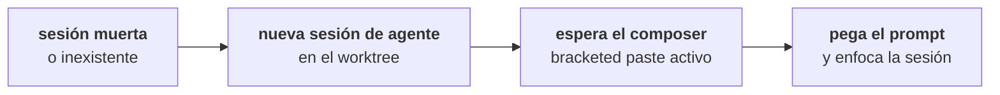

El ciclo que TYBA cierra aquí es el más pesado de hacer a mano: alguien revisó el PR, dejó comentarios repartidos por archivos y líneas, y ahora **alguien tiene que transcribir eso para el agente**.

No hace falta. El panel lee los comentarios, tú marcas cuáles valen, y van al composer de la sesión que escribió el código.

## Dónde está

Dentro del panel de revisión, en **Deliver**, justo debajo de la línea del PR — **Review comments**. Solo aparece cuando existe un PR abierto para la branch de la sesión.

<Note>
Necesita `gh` (o `glab`) instalado y autenticado. Sin la CLI, la lista viene **vacía**, sin error: leer comentarios es la API de la forja, y sin CLI no existe camino hasta ella. Esto no es un fallo tuyo — la mayoría de la gente no instala `gh`.
</Note>

## Lo que lee

<Tabs>
  <Tab title="GitHub">
    Dos colecciones, juntas en la misma lista:

    ```
    repos/{owner}/{repo}/pulls/<n>/comments    → comentarios de línea
    repos/{owner}/{repo}/issues/<n>/comments   → comentarios generales del PR
    ```
  </Tab>
  <Tab title="GitLab">
    ```
    projects/:fullpath/merge_requests/<n>/discussions
    ```
    Las discussions de la MR.
  </Tab>
</Tabs>

Cada ítem muestra `@autor`, el archivo y la línea (cuando el comentario está anclado), y el texto.

## Marcar y revisar

Marca en el checkbox lo que debe convertirse en trabajo. *Select all* / *Clear selection* en la esquina.

Con algo marcado, aparece **This is what gets sent to the agent** — el prompt exacto, abierto por defecto. No es un resumen: es el texto que se va a pegar.

```
Review do PR #42 (https://github.com/org/repo/pull/42) trouxe 2 comentário(s):

src/auth.ts:88 — @maria
Isso aqui não trata o caso do token expirado.

comentário geral — @joao
Falta teste pro caminho de erro.

Aplique as mudanças pedidas, mantendo o resto como está.
```

<Warning>
**Third-party content — review before forwarding to the agent.**

El aviso está en la interfaz, y es literal. Un comentario de PR es texto que escribió cualquier persona con acceso al repositorio, y estás a punto de pegarlo en un agente que edita código. El preview existe para que lo leas antes, no para que lo decores.

Lo que te protege del otro lado es la [clasificación de riesgo](/es/seguridad/clasificacion-de-riesgo): el prompt no cambia lo que el agente puede hacer solo.
</Warning>

## Reenviar

**Forward N comments to the agent**. TYBA pega el prompt en el composer de la sesión y **mueve el foco hacia ella**.

<Note>
El prompt se **pega, no se envía**. El `submit` va en `false`: lo lees, lo ajustas, y aprietas enter. TYBA no habla por el agente.
</Note>

Si sale bien, la selección se limpia y aparece *Forwarded to the agent ✓*.

## Cuando no hay sesión viva

Este es el caso común: el PR quedó abierto tres días, cerraste TYBA, el agente murió. El worktree sigue ahí.

Entonces TYBA **abre una sesión nueva** en el worktree y levanta el agente:



El que levanta es el **Review agent** de Settings.

<Warning>
Es siempre una **sesión de agente**, nunca un shell con el binario escrito dentro. Escribir `claude` en un shell levantaría el agente **sin sandbox, con todo tu entorno y — lo que importa — sin los hooks**: sin `PreToolUse` no hay gate, y un agente fuera del inbox hace lo que quiere.
</Warning>

## Review agent

**Settings → Preferences → Review agent.**

> Who receives the diff comments when no session is open in the worktree: Tyba opens a session, starts this agent and pastes the prompt into its composer.

| Opción | Lo que levanta |
| --- | --- |
| **Claude Code** | `claude` |
| **Codex** | `codex` |
| **Custom command…** | lo que escribas — ej.: `claude --model opus` |

El comando custom **corre dentro del worktree antes de que el prompt se pegue**. Tiene que ser un agente interactivo de verdad: TYBA espera a que el TUI encienda el bracketed paste (`DECSET 2004`) para saber que el composer está listo — son hasta 30 intentos de medio segundo, porque el cold start de un agente revienta cualquier `sleep` fijo. Un comando que nunca enciende bracketed paste no recibe el prompt.

<Note>
El mismo ajuste decide quién sugiere el mensaje de commit — con una salvedad: [la sugerencia solo acepta `claude` o `codex`](/es/review/commit-y-push#que-agente-responde). Un comando custom cae en `claude`.
</Note>

## Los otros dos caminos

La misma cañería sirve para dos cosas más, y vale saber que son el mismo engranaje:

| Origen | Prompt |
| --- | --- |
| **Comentarios que dejaste en el diff** ([Leer el diff](/es/review/leer-el-diff#comentar-una-linea)) | `Revisei o diff deste worktree (base <sha>..HEAD) e deixei N comentário(s)…` — con el fragmento de la línea citado |
| **Conflicto de merge** ([Merge local](/es/review/merge-local#materialize-cuando-hay-conflicto)) | los archivos en conflicto, para que el agente resuelva en la jaula |

En los tres casos: prompt pegado, foco en la sesión, tú aprietas enter.

## Lo que no existe

| | |
| --- | --- |
| **Responder el comentario en la forja** | No existe. TYBA lee; responder es allá. |
| **Marcar resuelto / resolver el thread** | No existe. |
| **Actualización automática de los comentarios** | No existe. La lista carga al abrir el panel y al cambiar de PR. |
| **Filtrar por autor o por archivo** | No existe. La lista es la lista. |
| **Enviar sin leer** | El preview abre por defecto, y es a propósito. |

## Ver también

<CardGroup cols={2}>
  <Card title="Pull requests" icon="git-pull-request" href="/es/review/pull-requests">
    Cómo llegó el PR hasta aquí.
  </Card>
  <Card title="Claude Code y Codex" icon="bot" href="/es/agente/claude-code-y-codex">
    Quiénes son los agentes que TYBA sabe levantar.
  </Card>
</CardGroup>
