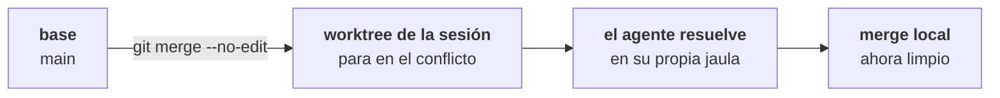

El merge local es la salida para quien no va a abrir PR: agarra los commits de la sesión y los pone en la **branch base**, ahí mismo, sin red.

Está en **Deliver → Merge locally**, en el pie del panel de revisión. Viene pintado de rojo y marcado `red action` — porque toca tu repositorio principal.

## El preview

Abrir el diálogo dispara `worktree_merge_preview` antes que nada. Muestra:

```
tyba/corrige-login-a3f → main

3 commits · 12 archivos
```

Y por debajo, lo que el preview fue a buscar de verdad:

| Campo | De dónde viene |
| --- | --- |
| `commits` | cuántos commits tiene la sesión más allá de la base |
| `files_changed` | `git diff --name-only base...HEAD` |
| `conflicts` | `git merge-tree --write-tree` — el merge se **simula**, sin tocar nada |
| `base_dirty` | si el **repo principal** tiene trabajo sin commitear |

El `merge-tree` es el punto: TYBA sabe si va a haber conflicto **sin** hacer el merge, sin checkout, sin stash, sin tocar tu directorio de trabajo.

## Las tres trabas

El botón *Merge into base* queda apagado, con el motivo escrito, en tres casos:

<Warning>
**La base está sucia.** *The base branch has uncommitted changes — commit or discard them before merging.* TYBA no va a mover tu trabajo en curso para que quepa un merge.
</Warning>

<Warning>
**Hay conflicto.** *Conflicts with the base in: `archivo`, `archivo`.* Aquí aparece el botón de escape — mira abajo.
</Warning>

<Note>
**No hay nada que mergear.** *Nothing to merge: no commits beyond the base.* O la sesión está en la propia branch base, y entonces no hay nada que hacer.
</Note>

## Estrategia

| | |
| --- | --- |
| **Squash** (por defecto) | Un commit único en la base. Mensaje automático: `squash: <branch>` |
| **Merge commit** | Preserva el historial de la sesión. Mensaje automático: `merge: <branch> em <base>` |

<Note>
El core acepta un mensaje custom, **pero el diálogo no tiene campo para él**. Hoy el mensaje es siempre el automático.
</Note>

## Confirmar

Dos clics. El primero arma (*Confirm merge?*, el botón se pone rojo), el segundo ejecuta.

Y lo que ejecuta **no es `git merge`**:

```bash
git commit-tree <tree> -p <base_head> [-p <source_head>] -m <msg>
git merge --ff-only <nuevo-commit>
```

El árbol ya vino del `merge-tree`. El commit se crea directo y la base avanza por fast-forward. Si la base cambió entre el preview y el clic, el `--ff-only` falla y ves *The base branch moved during the merge — nothing changed, try again*.

<Note>
**La base nunca queda a medio mergear.** O el fast-forward pasa, o no pasó nada. No existe un estado intermedio que tengas que limpiar.
</Note>

## Materialize: cuando hay conflicto

Con el merge trabado por conflicto, el diálogo ofrece **Resolve with agent**. Hace la cosa al revés — y a propósito:



El `materialize` trae la **base dentro del worktree de la sesión** y deja que el merge pare en el conflicto. Los archivos en conflicto quedan ahí, con marcadores, y TYBA manda el prompt de resolución al agente de esa sesión.

Tu checkout no se toca en ningún momento. Resuelto el conflicto en la sesión, el merge local corre limpio.

<Warning>
Materialize exige el **worktree de la sesión limpio**: *The session worktree has uncommitted changes — commit or discard them before materializing the conflict.*
</Warning>

## Después del merge

El diálogo da lugar a **Delivered — what about the worktree?**:

- **Keep** — el worktree sigue, la sesión sigue.
- **Remove worktree and close session** — dos clics, y desaparece.

<Warning>
Remover es `worktree remove --force` **y `git branch -D`**: el worktree se va y la branch local también. Si quedó trabajo sin commitear, el aviso aparece antes del segundo clic — *did NOT go into the PR/merge — removing will discard it permanently*.
</Warning>

## Lo que no existe

| | |
| --- | --- |
| **Rebase sobre la base** | No existe. Squash o merge commit. |
| **Mensaje de merge editable** | El core lo acepta; la interfaz no lo ofrece. |
| **Merge a una branch que no sea la base** | No existe. La base es la branch en la que **el repo principal está ahora**. |
| **Merge de una sesión sin worktree** | No existe — el comando exige worktree. |

## Ver también

<CardGroup cols={2}>
  <Card title="Pull requests" icon="git-pull-request" href="/es/review/pull-requests">
    La otra salida — la que pasa por la forja.
  </Card>
  <Card title="Worktrees" icon="folder-tree" href="/es/git/worktrees">
    Dónde se fijó la base, y qué queda después de remover.
  </Card>
</CardGroup>
