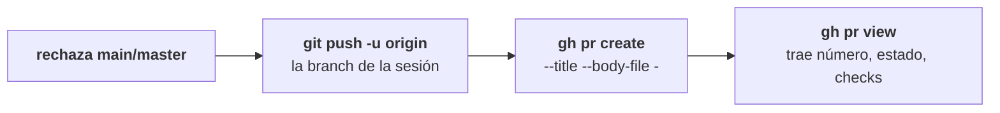

TYBA no tiene integración con GitHub. Tiene **tu `gh`** — y, en GitLab, tu `glab`. Ningún token de TYBA, ningún OAuth, ninguna cuenta.

Si ya corres `gh pr create` en la terminal, el botón hace exactamente eso, desde el worktree correcto, con el push antes.

## Cómo descubre la forja

Solo se mira una cosa: `git remote get-url origin`.

| Señal en el remote | Resultado |
| --- | --- |
| el host contiene `github` | **GitHub** → `gh` |
| el host contiene `gitlab` | **GitLab** → `glab` |
| host desconocido, pero el owner tiene `/` (subgrupo) | **GitLab** — el subgrupo es cosa de GitLab |
| host desconocido | consulta los hosts logueados en `~/.config/gh/hosts.yml` y en la config de `glab` |
| no coincide nada | **ninguna forja** |

Esto cubre GitHub Enterprise y GitLab self-hosted sin que configures nada — siempre que ya hayas hecho login en la CLI. El puerto y el `user@` del remote se ignoran.

<Note>
Un remote que no es ninguno de los dos (Bitbucket, por ejemplo): la sección Deliver dice *No forge detected (origin isn't GitHub or GitLab) — only local merge is available*, y el botón de PR ni aparece.
</Note>

## Lo que exige

<CardGroup cols={2}>
  <Card title="Para abrir un PR desde TYBA" icon="terminal">
    `gh` (o `glab`) **instalado y autenticado**.
  </Card>
  <Card title="Para no necesitar nada" icon="globe">
    El fallback: **Push and open in browser**.
  </Card>
</CardGroup>

Sin la CLI, el diálogo no muestra los campos: muestra *`gh` isn't installed* y un botón que hace push y abre la URL de comparación de tu branch en el navegador. El PR lo creas allá.

Sin autenticación, lo mismo — con el recado correcto: *Run "gh auth login" in the session's terminal.*

<Note>
La CLI solo es obligatoria para **ver las cosas dentro de TYBA**: estado del PR, checks, comentarios. Crear el PR funciona sin ella.
</Note>

### Dónde corre la CLI

Fuera de la jaula, en un entorno montado por allowlist — `GH_TOKEN`, `GITHUB_TOKEN`, `GH_HOST`, `GH_CONFIG_DIR`, `GLAB_TOKEN`, `XDG_CONFIG_HOME`, variables de proxy y poco más. El resto de tu entorno no va con él. Timeout de red: 30 segundos.

<Warning>
La sesión del agente **nunca** corre la CLI de la forja. El push y el PR los ejecuta TYBA, después de que hagas clic — que es el motivo de que el botón viva dentro de la revisión, después del diff.
</Warning>

## Abrir el PR

En **Deliver**, el botón dice *Open PR* (GitHub) u *Open MR* (GitLab). El diálogo pide título — ya rellenado con el título de la sesión — y descripción.

Al confirmar, en orden:

No necesitas haber hecho push antes — el `create_pr` lo hace.

<Warning>
Antes de todo eso, la misma traba del push: **la branch `main` o `master` se rechaza**, y [nunca hay camino alrededor](/es/seguridad/clasificacion-de-riesgo#lo-que-ni-siquiera-se-pregunta).
</Warning>

| Estado | El botón |
| --- | --- |
| Sin commits por delante (worktree) | Apagado — *Nothing to deliver — commit first.* |
| Hay trabajo sin commitear y ningún PR | Queda atenuado, pero funciona — lo que no se commiteó no va. |
| Ya existe un PR para la branch | Pasa a ser *View PR* y abre en el navegador. |

## Seguirlo

Con un PR abierto para la branch de la sesión, la sección Deliver gana una línea: estado (`open`, `merged`, `closed`, `draft`), `#número`, un punto agregado de los checks — verde, rojo, o ámbar girando — y un enlace a la forja.

### El panel de la forja

El icono de GitHub (o de GitLab) en el encabezado abre un popover con dos pestañas.

<Tabs>
  <Tab title="CI">
    Los **10 runs más recientes** — no es historial, es "¿y ahora?". El run en curso viene primero; después, por fecha. Expandir un run lista los **jobs**; hacer clic lo abre en la forja. Cada run muestra la branch **o tag** que lo disparó, que es como respondes "corté la tag, ¿y el release?".

    Mientras haya un run corriendo, el panel se actualiza cada 15 segundos. Todo parado, se detiene — cada tick es un proceso `gh` compitiendo con tus agentes.
  </Tab>
  <Tab title="Pull requests">
    Los PRs del repositorio, del más nuevo al más antiguo. Expandir un PR lista **qué check** está de qué manera — no solo el puntito agregado.
  </Tab>
</Tabs>

<Note>
**CI de GitLab: TYBA todavía no sabe leerlo.** El panel dice *I cannot read CI on this forge yet* — que es distinto de "ningún run". Los PRs, MRs, checks del PR y comentarios funcionan en las dos forjas; los workflow runs y jobs, solo en GitHub.
</Note>

## Después de abrirlo

Aparece **Delivered — what about the worktree?**: *PR opened. Remove this worktree and close the session, or keep it to keep working?*

<Warning>
**Remover borra la branch local** (`git branch -D`) junto con el worktree. La branch **remota** — la que el PR está usando — sigue ahí. El trabajo sin commitear, no: desaparece, y el diálogo avisa antes del segundo clic.

Si todavía esperas comentarios del review, **Keep** es la respuesta.
</Warning>

## Lo que no existe

| | |
| --- | --- |
| **Elegir la branch base del PR** | No existe. Es el valor por defecto de `gh`/`glab`. |
| **Draft, reviewers, labels, assignees** | No existe. Título y descripción. |
| **Mergear el PR desde TYBA** | No existe. Eso es en la forja. |
| **Bitbucket y otras forjas** | No existe. GitHub y GitLab. |
| **Token de TYBA** | No existe. La autenticación es la de tu CLI. |

## Ver también

<CardGroup cols={2}>
  <Card title="Comentarios del PR al agente" icon="message-square" href="/es/review/comentarios-al-agente">
    El review volvió. Mándalo directo a quien lo escribió.
  </Card>
  <Card title="Merge local" icon="git-merge" href="/es/review/merge-local">
    La salida sin forja.
  </Card>
</CardGroup>
