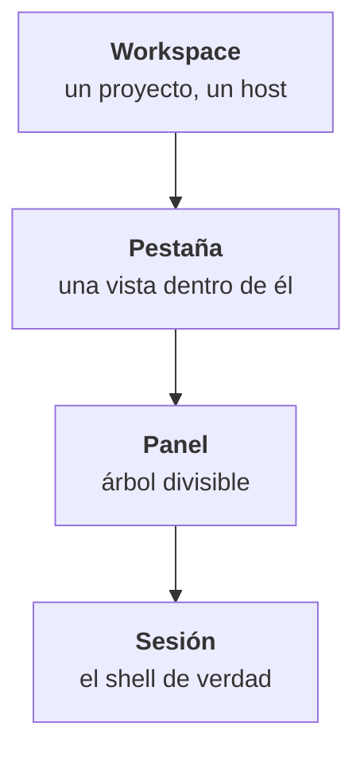

TYBA tiene cuatro capas apiladas. Entender su orden resuelve el 90% de la confusión de quien acaba de abrir la app.

| Capa | Qué es |
| --- | --- |
| **Workspace** | El contenedor de todo. Tiene nombre, color, grupo y una carpeta. Es lo que lista la sidebar. |
| **Pestaña** | Una vista dentro del workspace. Un workspace tiene varias. |
| **Panel** | El árbol de splits dentro de la pestaña. Todo panel puede dividirse de nuevo. |
| **Sesión** | El shell, el agente o la conexión SSH que corre ahí. Es el proceso. |

<Warning>
**La interfaz llama "session" al workspace.** La sidebar, el menú contextual (*Rename session*, *Session options*) y la paleta (*Search sessions…*) usan la palabra "session" para hablar del **workspace** — no del shell.

En esta documentación, *workspace* es la capa y *sesión* es el proceso. Cuando veas "session" en la pantalla, la mayoría de las veces es el workspace.
</Warning>

## La sidebar

`⌘B` en macOS, `Ctrl+Shift+B` en Windows y Linux. También en el icono a la izquierda del encabezado.

Lista **workspaces**, no pestañas. De arriba abajo:

| | |
| --- | --- |
| **Búsqueda** | *Search sessions…* — filtra la lista. Solo aparece con la sidebar abierta. |
| **System** | Un ítem: *Settings*. Es el engranaje. |
| **Code** | *Worktrees* — desactivado, marcado **Soon**. |
| **Tus grupos** | Cada grupo se pliega en el caret y tiene un `+` (*New session in this group*). |
| **Ungrouped** | Workspaces sin grupo. |
| **Pie** | *New session* y *SSH Connections*. |

<Note>
El engranaje está **arriba**, en el grupo *System* — no en el pie.
</Note>

### Qué hace el toggle

`⌘B` alterna entre **abierta** y un segundo estado que eliges en **Settings → Collapse panel**:

| Opción | Qué hace |
| --- | --- |
| **Collapse fully** (por defecto) | La sidebar desaparece. |
| **Icon rail** | Se convierte en una franja estrecha, solo con los iconos. |

No es un ciclo de tres — es un encender/apagar entre abierta y la opción elegida.

### Preview al pasar el mouse

Pasar el mouse **por un workspace de la sidebar** abre una tarjeta con el estado (*Running* / *Idle*, o el estado del agente), el runner, la carpeta, el branch, el diff y la cantidad de pestañas.

<Note>
Ese preview es **de la sidebar**. Pasar el mouse por una **pestaña** no muestra nada — la pestaña solo tiene el tooltip de su atajo numérico.
</Note>

### Dos toggles que cambian la densidad

En **Settings → Preferences**:

| Preferencia | Qué hace |
| --- | --- |
| **Session details in the sidebar** | Muestra más información en cada fila. Se puede sobrescribir por workspace en el menú contextual (*Show details* / *Hide details*). |
| **Git status in the sidebar** | Pone una etiqueta con el número de cambios sin commitear cuando la carpeta tiene cambios. |

## El encabezado

Una franja fina arriba. De izquierda a derecha:

| Ítem | Qué hace |
| --- | --- |
| **Toggle panel** | Enciende y apaga la sidebar. |
| **Command palette** | Abre la [paleta de acciones](/es/interfaz/paleta-de-comandos). |
| **Terminal / Workspace** | En el centro. **Workspace está desactivado — *Soon*.** |
| **Clock** | La hora. |
| **Containers** | Solo con Docker. Punto verde = hay un contenedor corriendo; rojo = el daemon está caído. |
| **View changes** | Abre el diff. Se pone ámbar cuando hay algo sin commitear. |
| **Open project folder** | `⌘O` / `Ctrl+Shift+O`. |
| **Notifications** | El inbox. |
| **Account** | Menú con *Settings* y *About Tyba*. |

## El inbox

El icono de bandeja en el encabezado, con un contador violeta cuando hay algo pendiente. Es por donde pasan las **aprobaciones de agente**.

Cada ítem muestra el riesgo, el comando, la sesión y la carpeta — y hacer clic en la fila de la sesión te lleva hasta ella. Con el inbox abierto, `1` `2` `3` deciden **el primero de la cola**.

<Warning>
**Una acción roja pide dos clics.** Aprobar un comando de riesgo alto cambia el botón a *Confirm* — solo el segundo clic lo resuelve. Y el rojo [nunca tiene "Always"](/es/seguridad/clasificacion-de-riesgo#lo-que-siempre-significa-realmente).
</Warning>

Vacío, dice: *All caught up. Agent session notifications arrive here.* Cuando la última aprobación desaparece, se cierra solo.

<Note>
**El inbox no tiene atajo.** Solo el clic en el icono lo abre.
</Note>

## La barra de chips

Una franja de 24px en el **pie de la terminal**, encendida por defecto. Es lo que controla la preferencia **Chip bar**.

Existen seis chips — y "diff" en realidad son dos:

| Chip | Qué muestra |
| --- | --- |
| **Current folder** | El nombre de la carpeta. La ruta entera en el tooltip. |
| **Git branch** | El branch. |
| **Uncommitted changes** | `archivos • +inserciones −eliminaciones`. Desaparece cuando está limpio. Al hacer clic abre el diff. |
| **Review worktree diff** | Solo cuando la sesión tiene worktree. |
| **Commits ahead and behind upstream** | Desaparece cuando los dos son cero. |
| **Clock** | Se actualiza cada 30s. |

Por defecto: *Uncommitted changes* y *Review worktree diff* a la izquierda; *ahead/behind*, *branch*, *carpeta* y *reloj* a la derecha.

### Reorganizar

Con la barra encendida, aparece el editor **Bar chips**: arrastra entre **Left**, **Right** y **Hidden**. *Restore defaults* devuelve el arreglo original — pero **no** enciende ni apaga la barra.

Funciona con el teclado: espacio levanta el chip, las flechas lo mueven, espacio lo suelta, `Esc` cancela.

<Note>
La barra también aloja el botón de **Rich Input** (`⌘⇧G` / `Ctrl+Shift+G`) cuando la sesión es elegible. No es un chip y no aparece en el editor.
</Note>

## Dónde seguir

<CardGroup cols={2}>
  <Card title="Pestañas y workspaces" icon="layout" href="/es/interfaz/pestanas-y-workspaces">
    La diferencia entre los dos, y qué se puede hacer con cada uno.
  </Card>
  <Card title="División de paneles" icon="columns" href="/es/interfaz/division-de-paneles">
    Dividir, navegar, redimensionar.
  </Card>
  <Card title="Paleta de comandos" icon="command" href="/es/interfaz/paleta-de-comandos">
    Las dos paletas y la diferencia entre ellas.
  </Card>
  <Card title="Atajos" icon="keyboard" href="/es/interfaz/atajos">
    La lista entera, y cómo remapear.
  </Card>
</CardGroup>
