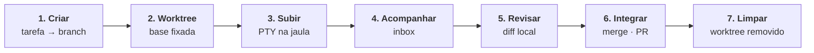

Uma sessão de agente no TYBA não é uma janela de chat. É um pipeline, e cada etapa é imposta pelo core em Rust — a interface só desenha o que ele decidiu.

Entender essas sete etapas é entender o produto inteiro.



## 1. Criar

Você descreve a tarefa. O core resolve a raiz do repositório e deriva uma branch:

```
tyba/<slug>-<sufixo>
```

O sufixo aleatório curto é o que impede duas sessões na mesma tarefa de brigarem pelo mesmo nome de branch.

## 2. Worktree

`git worktree add` a partir da base atual — e **o SHA da base é fixado aqui**.

Isso é o que faz a revisão do passo 5 ser utilizável: todo diff que você vê depois é `base_sha..HEAD`. Um agente que passou duas horas trabalhando não te afoga com tudo que entrou na `main` nesse meio-tempo.

Se o repositório tiver um `.tyba/setup.sh`, ele roda agora — é o lugar de fazer symlink do `.env`, `bun install`, subir banco por worktree.

## 3. Subir

O PTY nasce **dentro** do sandbox, com ambiente montado por allowlist.

Seu `DATABASE_URL` e seus tokens simplesmente não estão lá — o agente recebe seis variáveis e o que o [`.tyba/config.toml` do repositório](/pt-br/configuracao/repositorio) autorizar, depois de você aprovar.

A escrita fica no worktree e em temp. A leitura depende da plataforma — e essa diferença está em [Plataformas](/pt-br/seguranca/plataformas).

## 4. Acompanhar

A sessão reporta status:

| Status | O que é |
| --- | --- |
| `Running` | trabalhando |
| `AwaitingInput` | **precisa de você** |
| `Idle` | terminou, esperando |
| `Exited` | acabou |

Quando algo precisa da sua aprovação, vira item no inbox com notificação nativa — e a sessão **fica bloqueada** até você responder. Você responde ali, sem trocar de janela, e a resposta é escrita direto naquele PTY.

O que precisa de aprovação e o que passa sozinho está em [Classificação de risco](/pt-br/seguranca/classificacao-de-risco).

<Note>
O status não é adivinhado raspando a tela. O TYBA injeta hooks no agente e escuta os eventos num canal local: a ferramenta que vai rodar vira `Running`, o fim de turno vira `Idle`, e um pedido de resposta vira `AwaitingInput`. É o mesmo canal que alimenta o inbox de aprovações — [como o TYBA fala com o agente](/pt-br/agente/hooks).
</Note>

## 5. Revisar

A revisão é montada **só do git local** — não há ida ao GitHub. Timeline de commits, resumo por arquivo, e os hunks carregados sob demanda ao clicar.

<Note>
O diff de um lockfile tem dezenas de milhares de linhas. Ele fica fechado até você pedir.
</Note>

O que o agente deixou sem commitar também aparece.

## 6. Integrar

Merge local, squash, ou `gh pr create` pelo seu próprio `gh`.

<Note>
Push e merge são executados **pelo TYBA, fora da jaula**. A sessão do agente nunca teve credencial de rede — e é exatamente esse o ponto. O botão que aprova um push mora dentro da revisão, depois de você ter visto o diff.
</Note>

E, aconteça o que acontecer: [push de agente para `main` ou `master` é recusado pelo core](/pt-br/seguranca/classificacao-de-risco#o-que-nem-chega-a-ser-perguntado). Sempre.

## 7. Limpar

`git worktree remove` e coleta das branches órfãs.

## O que fazer agora

Rode duas sessões ao mesmo tempo no mesmo repositório. É onde o desenho aparece: a sessão A editando `src/` não vê nem atropela a árvore da sessão B, e nenhuma das duas encosta na sua cópia de trabalho.

<CardGroup cols={2}>
  <Card title="Classificação de risco" icon="shield" href="/pt-br/seguranca/classificacao-de-risco">
    O que o agente faz sozinho e o que espera por você.
  </Card>
  <Card title="Configuração" icon="sliders" href="/pt-br/configuracao/repositorio">
    Ambiente e agente padrão por repositório.
  </Card>
</CardGroup>
