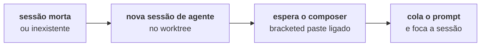

O ciclo que o TYBA fecha aqui é o mais chato de fazer à mão: alguém revisou o PR, deixou comentários espalhados por arquivos e linhas, e agora **alguém tem que transcrever isso para o agente**.

Não precisa. O painel lê os comentários, você marca quais valem, e eles vão para o composer da sessão que escreveu o código.

## Onde fica

Dentro do painel de revisão, em **Entregar**, logo abaixo da linha do PR — **Comentários da review**. Só aparece quando existe PR aberto para a branch da sessão.

<Note>
Precisa do `gh` (ou do `glab`) instalado e autenticado. Sem CLI, a lista vem **vazia**, sem erro: ler comentário é API da forja, e sem CLI não existe caminho até ela. Isso não é defeito seu — a maioria das pessoas não instala `gh`.
</Note>

## O que ele lê

<Tabs>
  <Tab title="GitHub">
    Duas coleções, juntas na mesma lista:

    ```
    repos/{owner}/{repo}/pulls/<n>/comments    → comentários de linha
    repos/{owner}/{repo}/issues/<n>/comments   → comentários gerais do PR
    ```
  </Tab>
  <Tab title="GitLab">
    ```
    projects/:fullpath/merge_requests/<n>/discussions
    ```
    As discussions da MR.
  </Tab>
</Tabs>

Cada item mostra `@autor`, o arquivo e a linha (quando o comentário está ancorado), e o texto.

## Marcar e conferir

Marque no checkbox o que deve virar trabalho. *Selecionar tudo* / *Limpar seleção* no canto.

Com algo marcado, aparece **Isto vai pro agente** — o prompt exato, aberto por padrão. Não é resumo: é o texto que será colado.

```
Review do PR #42 (https://github.com/org/repo/pull/42) trouxe 2 comentário(s):

src/auth.ts:88 — @maria
Isso aqui não trata o caso do token expirado.

comentário geral — @joao
Falta teste pro caminho de erro.

Aplique as mudanças pedidas, mantendo o resto como está.
```

<Warning>
**Conteúdo de terceiros — revise antes de encaminhar pro agente.**

O aviso está na interface, e é literal. Um comentário de PR é texto que qualquer pessoa com acesso ao repositório escreveu, e você está prestes a colar isso num agente que edita código. O preview existe para você ler antes, não para decorar.

O que protege do outro lado é a [classificação de risco](/pt-br/seguranca/classificacao-de-risco): o prompt não muda o que o agente pode fazer sozinho.
</Warning>

## Encaminhar

**Encaminhar N comentários pro agente**. O TYBA cola o prompt no composer da sessão e **muda o foco para ela**.

<Note>
O prompt é **colado, não enviado**. O `submit` vai `false`: você lê, ajusta, e aperta enter. O TYBA não fala pelo agente.
</Note>

Deu certo, a seleção limpa e aparece *Encaminhado pro agente ✓*.

## Quando não há sessão viva

Esse é o caso comum: o PR ficou aberto três dias, você fechou o TYBA, o agente morreu. O worktree continua lá.

Aí o TYBA **abre uma sessão nova** no worktree e sobe o agente:



Quem sobe é o **Agente de review** das Configurações.

<Warning>
É sempre uma **sessão de agente**, nunca um shell com o binário digitado dentro. Digitar `claude` num shell subiria o agente **sem sandbox, com o seu ambiente inteiro e — o que importa — sem os hooks**: sem `PreToolUse` não há gate, e um agente fora do inbox faz o que quiser.
</Warning>

## Agente de review

**Configurações → Preferências → Agente de review.**

> Quem recebe os comentários do diff quando não há sessão aberta no worktree: o Tyba abre uma sessão, sobe esse agente e cola o prompt no composer.

| Opção | O que sobe |
| --- | --- |
| **Claude Code** | `claude` |
| **Codex** | `codex` |
| **Comando custom…** | o que você escrever — ex.: `claude --model opus` |

O comando custom **roda dentro do worktree antes de o prompt ser colado**. Ele precisa ser um agente interativo de verdade: o TYBA espera o TUI ligar o bracketed paste (`DECSET 2004`) para saber que o composer está pronto — são até 30 tentativas de meio segundo, porque cold start de agente estoura qualquer `sleep` fixo. Um comando que nunca liga bracketed paste não recebe o prompt.

<Note>
O mesmo ajuste decide quem sugere mensagem de commit — com uma ressalva: [a sugestão só aceita `claude` ou `codex`](/pt-br/review/commit-e-push#qual-agente-responde). Comando custom cai em `claude`.
</Note>

## Os outros dois caminhos

O mesmo encanamento serve mais duas coisas, e vale saber que são a mesma engrenagem:

| Origem | Prompt |
| --- | --- |
| **Comentários que você deixou no diff** ([Ler o diff](/pt-br/review/ler-o-diff#comentar-uma-linha)) | `Revisei o diff deste worktree (base <sha>..HEAD) e deixei N comentário(s)…` — com o trecho da linha citado |
| **Conflito de merge** ([Merge local](/pt-br/review/merge-local#materialize-quando-da-conflito)) | os arquivos conflitados, para o agente resolver na jaula |

Nos três casos: prompt colado, foco na sessão, você aperta enter.

## O que não existe

| | |
| --- | --- |
| **Responder o comentário na forja** | Não existe. O TYBA lê; responder é lá. |
| **Marcar resolvido / resolver thread** | Não existe. |
| **Atualização automática dos comentários** | Não existe. A lista carrega ao abrir o painel e ao trocar de PR. |
| **Filtrar por autor ou por arquivo** | Não existe. A lista é a lista. |
| **Enviar sem ler** | O preview abre por padrão, e é de propósito. |

## Veja também

<CardGroup cols={2}>
  <Card title="Pull requests" icon="git-pull-request" href="/pt-br/review/pull-requests">
    Como o PR chegou até aqui.
  </Card>
  <Card title="Claude Code e Codex" icon="bot" href="/pt-br/agente/claude-code-e-codex">
    Quem são os agentes que o TYBA sabe subir.
  </Card>
</CardGroup>
