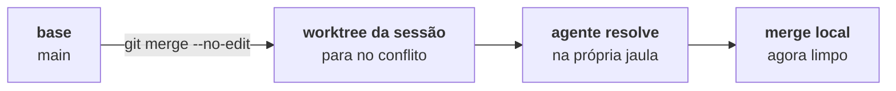

Merge local é a saída para quem não vai abrir PR: pega os commits da sessão e coloca na **branch base**, ali mesmo, sem rede.

Ele está em **Entregar → Merge local**, no rodapé do painel de revisão. Vem pintado de vermelho e marcado `ação vermelha` — porque mexe no seu repositório principal.

## O preview

Abrir o diálogo dispara `worktree_merge_preview` antes de qualquer coisa. Ele mostra:

```
tyba/corrige-login-a3f → main

3 commits · 12 arquivos
```

E por baixo, o que o preview foi buscar de verdade:

| Campo | De onde vem |
| --- | --- |
| `commits` | quantos commits a sessão tem além da base |
| `files_changed` | `git diff --name-only base...HEAD` |
| `conflicts` | `git merge-tree --write-tree` — o merge é **simulado**, sem tocar em nada |
| `base_dirty` | se o **repo principal** tem trabalho não commitado |

O `merge-tree` é o ponto: o TYBA sabe se vai dar conflito **sem** fazer o merge, sem checkout, sem stash, sem encostar no seu diretório de trabalho.

## As três travas

O botão *Mergear na base* fica desligado, com o motivo escrito, em três casos:

<Warning>
**A base está suja.** *A branch base tem mudanças não commitadas — commite ou descarte antes de mergear.* O TYBA não vai mexer no seu trabalho em andamento para caber um merge.
</Warning>

<Warning>
**Há conflito.** *Conflito com a base em: `arquivo`, `arquivo`.* Aqui aparece o botão de escape — veja abaixo.
</Warning>

<Note>
**Não há nada para mergear.** *Nada pra mergear: sem commits além da base.* Ou a sessão está na própria branch base, e aí não há o que fazer.
</Note>

## Estratégia

| | |
| --- | --- |
| **Squash** (padrão) | Um commit único na base. Mensagem automática: `squash: <branch>` |
| **Merge commit** | Preserva o histórico da sessão. Mensagem automática: `merge: <branch> em <base>` |

<Note>
O core aceita mensagem custom, **mas o diálogo não tem campo para ela**. Hoje a mensagem é sempre a automática.
</Note>

## Confirmar

Dois cliques. O primeiro arma (*Confirmar merge?*, o botão fica vermelho), o segundo executa.

E o que executa **não é `git merge`**:

```bash
git commit-tree <tree> -p <base_head> [-p <source_head>] -m <msg>
git merge --ff-only <novo-commit>
```

A árvore já veio do `merge-tree`. O commit é criado direto e a base avança por fast-forward. Se a base tiver mudado entre o preview e o clique, o `--ff-only` falha e você vê *A branch base mudou durante o merge — nada foi alterado, tente de novo*.

<Note>
**A base nunca fica meio-mergeada.** Ou o fast-forward passa, ou nada aconteceu. Não existe estado intermediário para você limpar.
</Note>

## Materialize: quando dá conflito

Com o merge travado por conflito, o diálogo oferece **Resolver com agente**. Ele faz a coisa ao contrário — e de propósito:



O `materialize` traz a **base para dentro do worktree da sessão** e deixa o merge parar no conflito. Os arquivos conflitados ficam lá, com marcadores, e o TYBA manda o prompt de resolução para o agente daquela sessão.

O seu checkout não é tocado em momento nenhum. Resolvido o conflito na sessão, o merge local roda limpo.

<Warning>
Materialize exige o **worktree da sessão limpo**: *O worktree da sessão tem mudanças não commitadas — commite ou descarte antes de materializar o conflito.*
</Warning>

## Depois do merge

O diálogo dá lugar a **Entrega feita — e o worktree?**:

- **Manter** — o worktree continua, a sessão continua.
- **Remover worktree e encerrar sessão** — dois cliques, e some.

<Warning>
Remover é `worktree remove --force` **e `git branch -D`**: o worktree vai embora e a branch local também. Se sobrou trabalho não commitado, o aviso aparece antes do segundo clique — *NÃO foi pro PR/merge — remover vai descartá-lo permanentemente*.
</Warning>

## O que não existe

| | |
| --- | --- |
| **Rebase na base** | Não existe. Squash ou merge commit. |
| **Mensagem de merge editável** | O core aceita; a interface não oferece. |
| **Merge para uma branch que não seja a base** | Não existe. A base é a branch em que **o repo principal está agora**. |
| **Merge de sessão sem worktree** | Não existe — o comando exige worktree. |

## Veja também

<CardGroup cols={2}>
  <Card title="Pull requests" icon="git-pull-request" href="/pt-br/review/pull-requests">
    A outra saída — a que passa pela forja.
  </Card>
  <Card title="Worktrees" icon="folder-tree" href="/pt-br/git/worktrees">
    Onde a base foi fixada, e o que sobra depois de remover.
  </Card>
</CardGroup>
