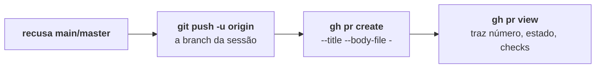

O TYBA não tem integração com GitHub. Ele tem **o seu `gh`** — e, no GitLab, o seu `glab`. Nenhum token do TYBA, nenhum OAuth, nenhuma conta.

Se você já roda `gh pr create` no terminal, o botão faz exatamente isso, do worktree certo, com o push antes.

## Como ele descobre a forja

Só uma coisa é olhada: `git remote get-url origin`.

| Sinal no remote | Resultado |
| --- | --- |
| host contém `github` | **GitHub** → `gh` |
| host contém `gitlab` | **GitLab** → `glab` |
| host desconhecido, mas o owner tem `/` (subgrupo) | **GitLab** — subgrupo é coisa de GitLab |
| host desconhecido | consulta os hosts logados no `~/.config/gh/hosts.yml` e no config do `glab` |
| nada bate | **nenhuma forja** |

Isso cobre GitHub Enterprise e GitLab self-hosted sem você configurar nada — desde que você já tenha feito login na CLI. Porta e `user@` no remote são ignorados.

<Note>
Remote que não é nenhum dos dois (Bitbucket, por exemplo): a seção Entregar diz *O remote não é GitHub nem GitLab — só merge local disponível*, e o botão de PR nem aparece.
</Note>

## O que ele exige

<CardGroup cols={2}>
  <Card title="Para abrir PR pelo TYBA" icon="terminal">
    `gh` (ou `glab`) **instalado e autenticado**.
  </Card>
  <Card title="Para não precisar de nada" icon="globe">
    O fallback: **Push e abrir no navegador**.
  </Card>
</CardGroup>

Sem CLI, o diálogo não mostra os campos: mostra *`gh` não está instalado* e um botão que faz push e abre a URL de comparação da sua branch no navegador. O PR você cria lá.

Sem autenticação, o mesmo — com o recado certo: *Rode "gh auth login" no terminal da sessão.*

<Note>
A CLI só é obrigatória para **ver as coisas dentro do TYBA**: estado do PR, checks, comentários. Criar o PR funciona sem ela.
</Note>

### Onde a CLI roda

Fora da jaula, num ambiente montado por allowlist — `GH_TOKEN`, `GITHUB_TOKEN`, `GH_HOST`, `GH_CONFIG_DIR`, `GLAB_TOKEN`, `XDG_CONFIG_HOME`, variáveis de proxy e pouco mais. O resto do seu ambiente não vai junto. Timeout de rede: 30 segundos.

<Warning>
A sessão do agente **nunca** roda a CLI da forja. Push e PR são executados pelo TYBA, depois de você clicar — que é o motivo de o botão morar dentro da revisão, depois do diff.
</Warning>

## Abrir o PR

Em **Entregar**, o botão diz *Abrir PR* (GitHub) ou *Abrir MR* (GitLab). O diálogo pede título — já preenchido com o título da sessão — e descrição.

Ao confirmar, na ordem:

Você não precisa ter feito push antes — o `create_pr` faz.

<Warning>
Antes de tudo isso, a mesma trava do push: **branch `main` ou `master` é recusada**, e [nunca há caminho em volta](/pt-br/seguranca/classificacao-de-risco#o-que-nem-chega-a-ser-perguntado).
</Warning>

| Estado | O botão |
| --- | --- |
| Sem commits à frente (worktree) | Desligado — *Nada a entregar — commite primeiro.* |
| Há trabalho não commitado e nenhum PR | Fica esmaecido, mas funciona — o que não foi commitado não vai. |
| PR já existe para a branch | Vira *Ver PR* e abre no navegador. |

## Acompanhar

Com PR aberto para a branch da sessão, a seção Entregar ganha uma linha: estado (`aberto`, `mergeado`, `fechado`, `rascunho`), `#número`, um ponto agregado dos checks — verde, vermelho, ou âmbar girando — e um link para a forja.

### O painel da forja

O ícone do GitHub (ou do GitLab) no cabeçalho abre um popover com duas abas.

<Tabs>
  <Tab title="CI">
    Os **10 runs mais recentes** — não é histórico, é "e agora?". Run em andamento vem primeiro; depois, por data. Expandir um run lista os **jobs**; clicar abre na forja. Cada run mostra a branch **ou tag** que o disparou, que é como você responde "cortei a tag, e o release?".

    Enquanto houver run rodando, o painel se atualiza a cada 15 segundos. Tudo parado, ele para — cada tick é um processo `gh` competindo com os seus agentes.
  </Tab>
  <Tab title="Pull requests">
    Os PRs do repositório, do mais novo para o mais antigo. Expandir um PR lista **qual check** está de que jeito — não só o pontinho agregado.
  </Tab>
</Tabs>

<Note>
**CI do GitLab: o TYBA ainda não sabe ler.** O painel diz *Ainda não sei ler o CI desta forja* — que é diferente de "nenhum run". PRs, MRs, checks do PR e comentários funcionam nas duas forjas; workflow runs e jobs, só no GitHub.
</Note>

## Depois de abrir

Aparece **Entrega feita — e o worktree?**: *PR aberto. Quer remover este worktree e encerrar a sessão, ou manter pra continuar trabalhando?*

<Warning>
**Remover apaga a branch local** (`git branch -D`) junto com o worktree. A branch **remota** — a que o PR está usando — continua lá. O trabalho não commitado, não: some, e o diálogo avisa antes do segundo clique.

Se você ainda espera comentários do review, **Manter** é a resposta.
</Warning>

## O que não existe

| | |
| --- | --- |
| **Escolher a branch base do PR** | Não existe. É o padrão do `gh`/`glab`. |
| **Draft, reviewers, labels, assignees** | Não existe. Título e descrição. |
| **Mergear o PR pelo TYBA** | Não existe. Isso é na forja. |
| **Bitbucket e outras forjas** | Não existe. GitHub e GitLab. |
| **Token do TYBA** | Não existe. A autenticação é a da sua CLI. |

## Veja também

<CardGroup cols={2}>
  <Card title="Comentários do PR para o agente" icon="message-square" href="/pt-br/review/comentarios-para-o-agente">
    O review voltou. Mande direto para quem escreveu.
  </Card>
  <Card title="Merge local" icon="git-merge" href="/pt-br/review/merge-local">
    A saída sem forja.
  </Card>
</CardGroup>
