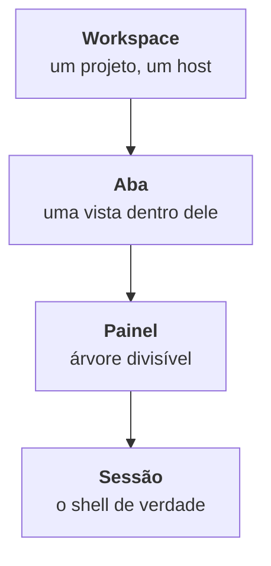

O TYBA tem quatro camadas empilhadas. Entender a ordem delas resolve 90% da confusão de quem abriu o app agora.

| Camada | O que é |
| --- | --- |
| **Workspace** | O container de tudo. Tem nome, cor, grupo e uma pasta. É o que a sidebar lista. |
| **Aba** | Uma vista dentro do workspace. Um workspace tem várias. |
| **Painel** | A árvore de splits dentro da aba. Todo painel pode ser dividido de novo. |
| **Sessão** | O shell, o agente ou a conexão SSH que roda ali. É o processo. |

<Warning>
**A interface chama workspace de "sessão".** A sidebar, o menu de contexto (*Renomear sessão*, *Opções da sessão*) e a paleta (*Buscar sessão…*) usam a palavra "sessão" para falar do **workspace** — não do shell.

Nesta documentação, *workspace* é a camada e *sessão* é o processo. Quando você vir "sessão" na tela, na maioria das vezes é o workspace.
</Warning>

## A sidebar

`⌘B` no macOS, `Ctrl+Shift+B` no Windows e Linux. Também no ícone à esquerda do cabeçalho.

Ela lista **workspaces**, não abas. De cima para baixo:

| | |
| --- | --- |
| **Busca** | *Buscar sessão…* — filtra a lista. Só aparece com a sidebar aberta. |
| **Sistema** | Um item: *Configurações*. É a engrenagem. |
| **Code** | *Worktrees* — desligado, marcado **Em breve**. |
| **Seus grupos** | Cada grupo dobra no caret e tem um `+` (*Nova sessão neste grupo*). |
| **Avulsos** | Workspaces sem grupo. |
| **Rodapé** | *Nova sessão* e *Conexões SSH*. |

<Note>
A engrenagem fica **no topo**, no grupo *Sistema* — não no rodapé.
</Note>

### O que o toggle faz

`⌘B` alterna entre **aberta** e um segundo estado que você escolhe em **Configurações → Recolher painel**:

| Opção | O que faz |
| --- | --- |
| **Recolher tudo** (padrão) | A sidebar some. |
| **Modo ícones** | Vira uma faixa estreita, só com os ícones. |

Não é um ciclo de três — é um liga-desliga entre aberta e a opção escolhida.

### Preview ao passar o mouse

Passar o mouse **num workspace da sidebar** abre um cartão com status (*Executando* / *Ocioso* ou o estado do agente), o runner, a pasta, a branch, o diff e a contagem de abas.

<Note>
Esse preview é **da sidebar**. Passar o mouse numa **aba** não mostra nada — a aba só tem o tooltip do atalho numérico.
</Note>

### Dois toggles que mudam a densidade

Em **Configurações → Preferências**:

| Preferência | O que faz |
| --- | --- |
| **Detalhes da sessão na sidebar** | Mostra mais informação em cada linha. Dá para sobrescrever por workspace no menu de contexto (*Mostrar detalhes* / *Ocultar detalhes*). |
| **Status do git na sidebar** | Põe um rótulo com o número de alterações não commitadas quando a pasta tem mudanças. |

## O cabeçalho

Uma faixa fina no topo. Da esquerda para a direita:

| Item | O que faz |
| --- | --- |
| **Alternar painel** | Liga e desliga a sidebar. |
| **Paleta de comandos** | Abre a [paleta de ações](/pt-br/interface/paleta-de-comandos). |
| **Terminal / Workspace** | No centro. **Workspace está desligado — *Em breve*.** |
| **Relógio** | A hora. |
| **Containers** | Só com Docker. Ponto verde = tem container rodando; vermelho = daemon fora do ar. |
| **Ver alterações** | Abre o diff. Fica âmbar quando há coisa não commitada. |
| **Abrir pasta do projeto** | `⌘O` / `Ctrl+Shift+O`. |
| **Notificações** | O inbox. |
| **Conta** | Menu com *Configurações* e *Sobre o Tyba*. |

## O inbox

O ícone de bandeja no cabeçalho, com um contador violeta quando há pendência. É por onde as **aprovações de agente** passam.

Cada item mostra o risco, o comando, a sessão e a pasta — e clicar na linha da sessão te leva até ela. Com o inbox aberto, `1` `2` `3` decidem **a primeira da fila**.

<Warning>
**Ação vermelha pede dois cliques.** Aprovar um comando de risco alto troca o botão para *Confirmar* — só o segundo clique resolve. E vermelho [nunca tem "Sempre"](/pt-br/seguranca/classificacao-de-risco#o-que-sempre-realmente-significa).
</Warning>

Vazio, ele diz: *Tudo em dia. Notificações de sessões de agente chegam aqui.* Quando a última aprovação some, ele fecha sozinho.

<Note>
**O inbox não tem atalho.** Só o clique no ícone abre.
</Note>

## A barra de chips

Uma faixa de 24px no **rodapé do terminal**, ligada por padrão. É o que a preferência **Barra de chips** controla.

Seis chips existem — e "diff" na verdade são dois:

| Chip | O que mostra |
| --- | --- |
| **Pasta atual** | O nome da pasta. O caminho inteiro no tooltip. |
| **Branch do git** | A branch. |
| **Alterações não commitadas** | `arquivos • +inserções −remoções`. Some quando está limpo. Clicar abre o diff. |
| **Revisar diff do worktree** | Só quando a sessão tem worktree. |
| **Commits à frente e atrás do upstream** | Some quando os dois são zero. |
| **Relógio** | Atualiza a cada 30s. |

Padrão: *Alterações não commitadas* e *Revisar diff* à esquerda; *à frente/atrás*, *branch*, *pasta* e *relógio* à direita.

### Reorganizar

Com a barra ligada, aparece o editor **Chips da barra**: arraste entre **Esquerda**, **Direita** e **Ocultos**. *Restaurar padrão* devolve o arranjo original — mas **não** liga nem desliga a barra.

Funciona pelo teclado: espaço levanta o chip, as setas movem, espaço solta, `Esc` cancela.

<Note>
A barra também abriga o botão do **Rich Input** (`⌘⇧G` / `Ctrl+Shift+G`) quando a sessão é elegível. Ele não é um chip e não aparece no editor.
</Note>

## Onde continuar

<CardGroup cols={2}>
  <Card title="Abas e workspaces" icon="layout" href="/pt-br/interface/abas-e-workspaces">
    A diferença entre os dois, e o que dá para fazer com cada um.
  </Card>
  <Card title="Split de painéis" icon="columns" href="/pt-br/interface/split-de-paineis">
    Dividir, navegar, redimensionar.
  </Card>
  <Card title="Paleta de comandos" icon="command" href="/pt-br/interface/paleta-de-comandos">
    As duas paletas e a diferença entre elas.
  </Card>
  <Card title="Atalhos" icon="keyboard" href="/pt-br/interface/atalhos">
    A lista inteira, e como remapear.
  </Card>
</CardGroup>
